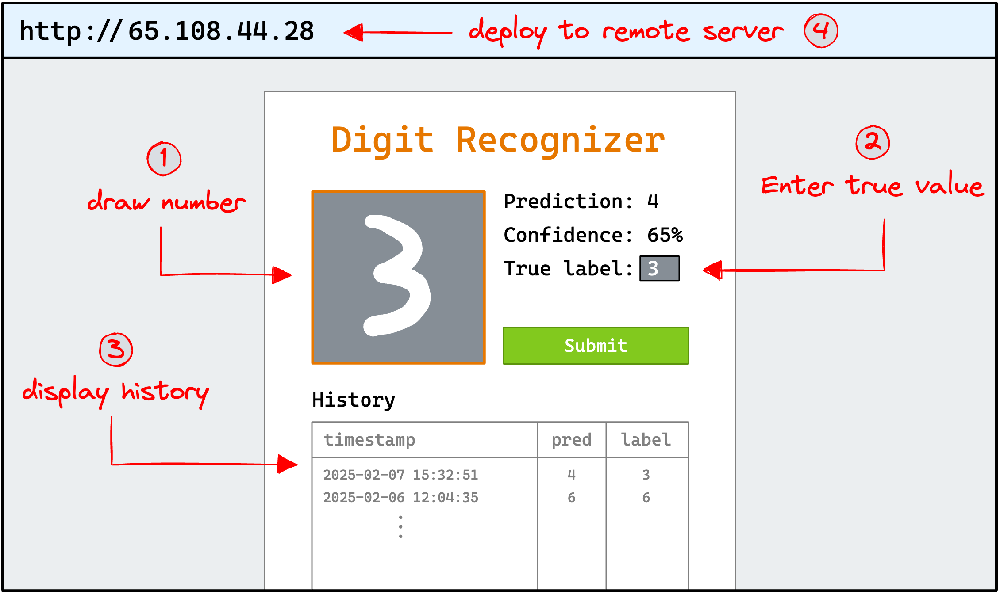

# Machine Learning Institute Programme Assignment

## Foundation Project
https://programme.mlx.institute/interview/project

### Overview

Building an end-to-end application on a self-managed server is the best way to prepare for our programme. The foundation project is a simplified version of the projects you will build every week during the programme, so it's an excellent way for you to learn and prepare and for us to assess whether you're ready for our residency. To complete this exercise, you need to build, containerize, and deploy an MNIST digit classifier.

### Project Brief

Goal: Build, containerize, and deploy a simple digit-recogniser trained on the MNIST dataset.

Below is a wireframe of the application you will build. It doesn't need to be laid out exactly as shown, but it should contain all the necessary functionality.




For a live example of the application visit the link below:
https://mnist-example.mlx.institute

1. Train a PyTorch Model
 - Develop a basic PyTorch model to classify handwritten digits from the MNIST dataset.
- Train it locally and confirm that it achieves a reasonable accuracy.

2. Interactive Front-End
 - Create a web interface (using Streamlit) where users can draw a digit on a canvas or input area.
 - When the user submits the drawing, the web app should run the trained PyTorch model to produce:
   - Prediction: the model's guess at the digit (0–9).
   - Confidence: the model's probability for its prediction.
   - True Label: allow the user to manually input the correct digit so you can gather feedback.

3. Logging with PostgreSQL
 - Every time a prediction is made, log these details to a PostgreSQL database:
  - Timestamp
  - Predicted digit
  - User-provided true label

4. Containerization with Docker
  - Use Docker to containerize:
    - The PyTorch model/service
    - The Streamlit web app
    - The PostgreSQL database
  - Use Docker Compose to define your multi-container setup in a docker-compose.yml file.

5. Deployment
 - Set up a self-managed server (e.g., Hetzner's basic instance) or any other environment where you can install Docker and control the deployment end-to-end.
 - Deploy your containerized application to the server and make it accessible via a public IP or domain.

6. Add project to GitHub
 - Add your project to GitHub.
 - Make sure to include a README with a link to the live application.
 - Share the link to your GitHub repository with us via the application form.

## Project Structure

This project follows a clean separation of concerns with the following folder structure:

```
mlx-test1/
├── data/           # MNIST dataset storage
├── model/          # MnistModel.py + api.py (ML + FastAPI service)
│   └── requirements.txt
├── db/             # PostgreSQL schema initialization and documentation
├── app/            # Gradio UI (communicates with API and database via SQLAlchemy)
│   └── requirements.txt
└── docker-compose.yml
```

### Architecture

- **data/**: Stores downloaded MNIST dataset
- **model/**: Self-contained module with:
  - `MnistModel.py` - ML operations (download, train, eval, inference)
  - `api.py` - FastAPI service exposing model endpoints
- **db/**: Database schema and PostgreSQL setup documentation
- **app/**: Gradio web interface that:
  - Calls model API endpoints for predictions
  - Logs results to PostgreSQL via SQLAlchemy
  - Provides interactive drawing canvas for digit recognition

## Setup Instructions

### Environment Setup

```shell
# Clone repository
git clone https://github.com/charles-cai/mlx-test1.git
cd mlx-test1

# Create virtual environment (WSL Ubuntu 22.04 LTS)
uv venv --python=python3.12
source .venv/bin/activate

# Install dependencies for each component
cd model && pip install -r requirements.txt && cd ..
cd app && pip install -r requirements.txt && cd ..
```

### Model Training

```shell
# Train MNIST model
cd model
python MnistModel.py --train --epochs 5
python MnistModel.py --help  # See all available options
cd ..
```

### Database Setup

```shell
# Initialize PostgreSQL schema
cd db
# Follow README.md instructions for database setup
cd ..
```

## Quick Start

For detailed deployment instructions, see [DEPLOYMENT.md](DEPLOYMENT.md).

```shell
# 1. Clone and setup
git clone https://github.com/charles-cai/mlx-test1.git
cd mlx-test1
uv venv --python=python3.12
source .venv/bin/activate

# 2. Install dependencies
cd model && pip install -r requirements.txt && cd ..
cd app && pip install -r requirements.txt && cd ..

# 3. Train model (if needed)
cd model
python MnistModel.py --train --epochs 5
cd ..

# 4. Start all services
docker-compose up --build

# Access points:
# - Gradio UI: http://localhost:7860
# - FastAPI: http://localhost:8000
# - PostgreSQL: localhost:5432
```

